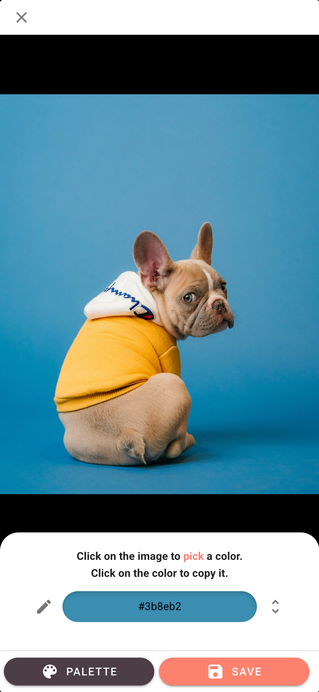
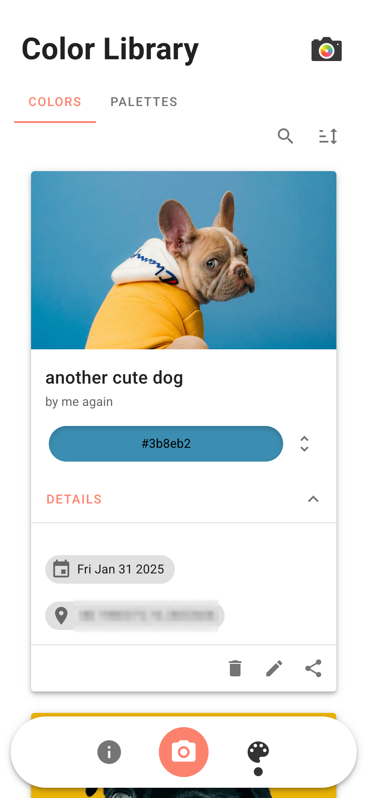
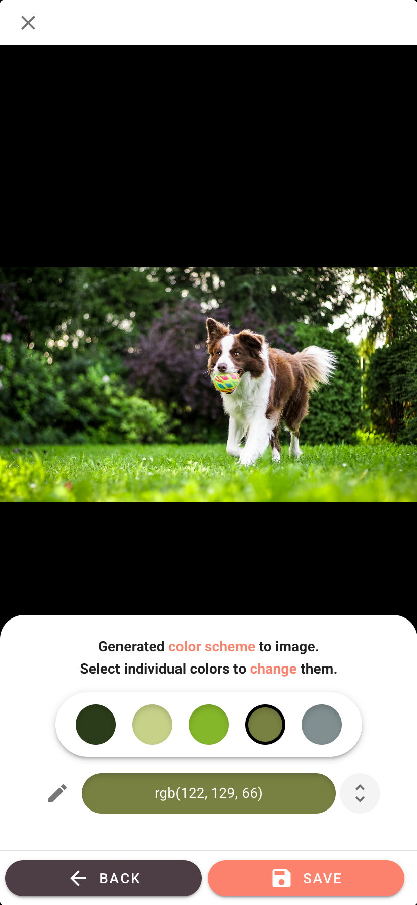
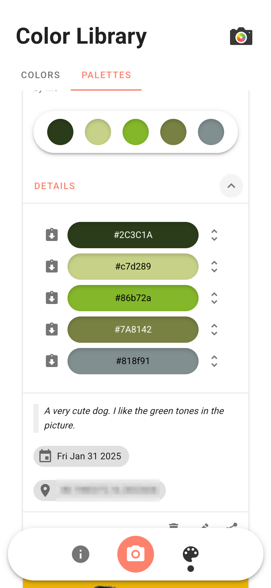
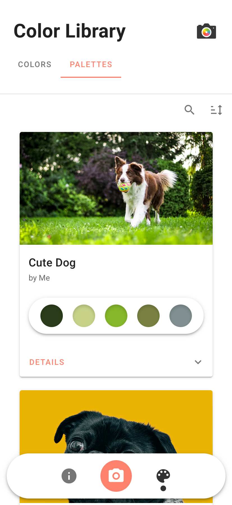

# ColorCapture
ColorCapture is a Progressive Web App (PWA) that allows users to capture or upload images and generate color palettes from them. Users can manage and adjust these palettes as needed.

## Main Features
* Capture or upload images to generate colors or palettes
* Save and organize colors and palettes
* Easily copy color values and convert between RGB, HEX, and HSL
* Adjust and fine-tune generated colors and palettes

## Screenshots
TODO structure better
<div>
   
   
   
   
   
</div>

## Technologies
* Frontend, Vue JS 2, Vuetify
* Backend, Node JS & Express, PostgreSQL

## How to run
### Database
```
cd ./database
```

Start
```
docker-compose up --build -d
```

Stop
```
docker-compose down -v
```

### Server

```
cd ./cc-server
```

Dependencies

```
npm i
```

Run

```
npm start
```

### Frontend
build TBD

## Background
This project was developed as part of a school assignment during the 2021/2022 academic year. The primary goal was to explore Progressive Web Apps (PWA) and experiment with various technologies.

As a learning exercise, the app includes features like location access, text-to-speech, and content sharing—not necessarily because they were essential, but to gain hands-on experience with them. Since the focus was on experimentation, certain aspects, such as image handling, authentication, and user management, were not prioritized or fully implemented. This project is intended purely for educational purposes.